# Testing

## Table of contents

1. Browsers I tested
2. Changes made after testing
3. W3 validators
4. Contact and newsletter forms
5. Testing the user stories
---

### Browsers I tested

- Chrome
- Firefox
- Safari
- Opera

I tried these browsers. I looked at all the different sizes in the inspect mode ( Except for in safari, because it does not have that option). It works in widescreen, desktop, tablet and mobile.
I have tested it on my laptop computer and also on a big screen. I tested it on two different Iphones and on a Samsung Galaxy. It works as it should on all devises.

I also asked friends to test the website on their mobiles. It all works as it should.

### Changes made after testing

When testing the products cards on the smallest size smartphone and also the tablet size in google chrome, Firefox and Opera it looked strange. The text got very stretched out and it didn’t look good. I also tested this on a real Iphone and a Samsung Galaxy with the same result. I removed the product info text from the card and changed it to a button with the text Read more. This button opens a modal with the product info text.

After my second mentor session for this project, I added a added links to a fictional facebook webshop. I added a link to the shop in the navbar and also a buy button that links to the fictional shop. The button can be found on all pages, except on the contact page. There is also a buy button in the popup modal in each product card.

I tested the buy button that links to the company’s fictional Facebook web shop. 
I tested it in all browsers and devices i mentioned earlier. It works as it should and the link opens in a new tab.

### W3 validator

#### HTML validator - https://validator.w3.org/

I tested my code in the w3 html validator. I got two errors. The first error was in the what customers say section in the index.html page. The problem was that there was no header directly after the section tag. The header came later in the section. I moved the header so that it comes directly after the section tag. It worked and it was approved.

The second error was in the same section. It had to do with the customer review images. I am not really sure exactly what the second error was. I changed these two things and it got approved. 

- The div that contained the customer images had a class attribute but with no value. I removed that class attribute from the div tag. 
- Secondly, the hight and width properties for the customer images was in the img tag. I moved the hight and width properties to my style.css. 

After doing these changes the code was approved by W3 html validator.

#### CSS validator - https://jigsaw.w3.org/css-validator/

Again I got two errors. But this time the errors where not from any code i've written in my workspace. The errors were from the bootstrap library. The errors were found in this link https://maxcdn.bootstrapcdn.com/bootstrap/4.2.1/css/bootstrap.min.css

There where also some warnings. Again it was not from any code I’ve written. It came from the bootsnipp code I use for the newsletter. The warning came from this link script //cdnjs.cloudflare.com/ajax/libs/jquery/3.2.1/jquery.min.js

I wrote to tutor assistance. They said it will be ok as long as I mention it here in this README. 

### Contact and newsletter forms

I tested the contact and newsletter forms. 
- When submitting without any message an error message about the required fields appears.
- When submitting with an invalid email address an error message about the required fields appears.
- When submitting the form with all inputs valid a success message success message opens in a new tab.

### Testing the user stories:

### User Story item 1: 

As a new visitor to this company website, I want to instantly know what this company sells to see if it fits my needs.

Answer: 

- The user wants to know what this page website is about. The banner image on the home page show bottles of organic deodorants so that the user will instantly know that this is a website for an organic deodorant. The texts on the home page gives the user information about the product.

- The first headline of the home page clearly states that it is a website for an organic deodorant.

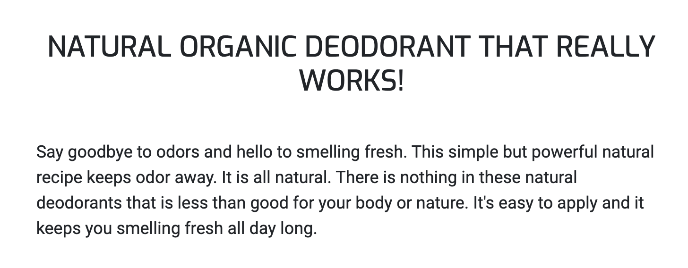

- The products page shows that the products are organic deodorants.

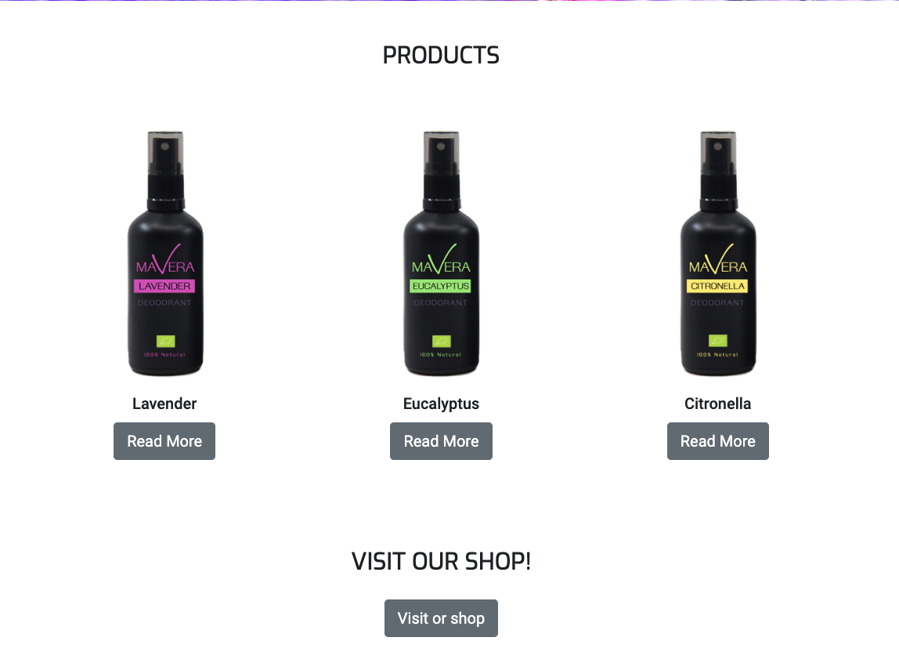

- If the user is looking for organic deodorants they have come to the right place.
- What’s left to implement is to change the print on the bottle so that it says Organic Deodorant instead of just deodorant. The purpose of this is to make it even more clear that this company sells organic deodorants.

### User Story item 2: 

As a visitor to this website, I want to easily navigate the site so that I can find what I am looking for.

Answer:

- There is a responsive navbar that makes it easy to navigate the website. 

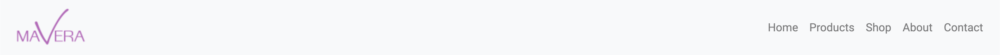

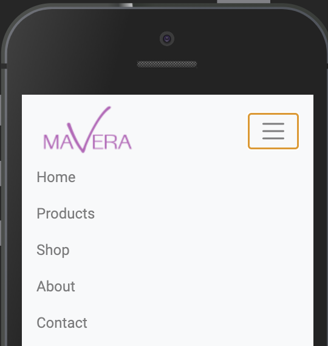

- If the user wants to know more about the products, they can click the products link in the nav bar. The products page gives the user information about each individual product and where they can buy it. 

- If the user wants to know more about the company, they can click the about link in the nav bar. The about page tells the user about the company values.

- If the user wants to contact the company they can find all the contact information on the contact page.There is a link in the navbar to the contacts page.

- If the user wants to find retailers that sell the products there is information on the products page.

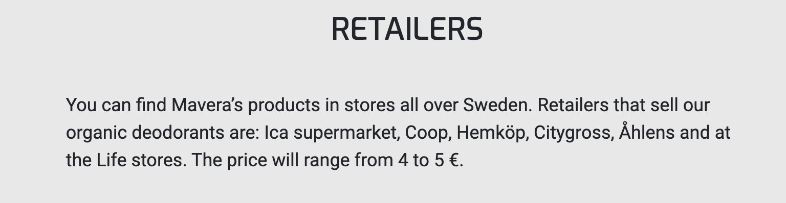

- If the user wants to buy the product there are several links to the web shop. There is a link to the shop in the navbar and on every page.

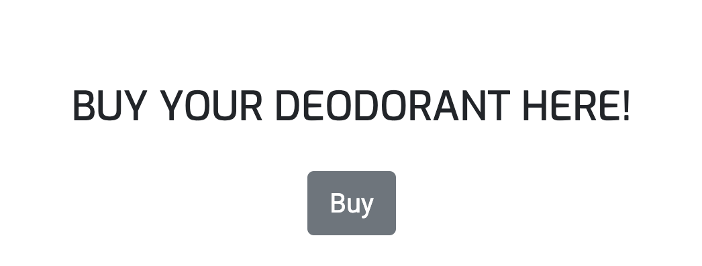

### User Story item 3: 

As a visitor to this website, I want to find organic deodorants.

Answer:

- The products page and home page gives information about the companies organic deodorants and there are links on all pages to the facebook web shop where they can buy the products.

- On the products page there is information about which retailers that sell the products.

### User Story item 4: 

As a visitor to this website, I want to know if these deodorants really work.

Answer:

- The purpose of the customer reviews on the home page is to give the product credibility and show the user that the product works.

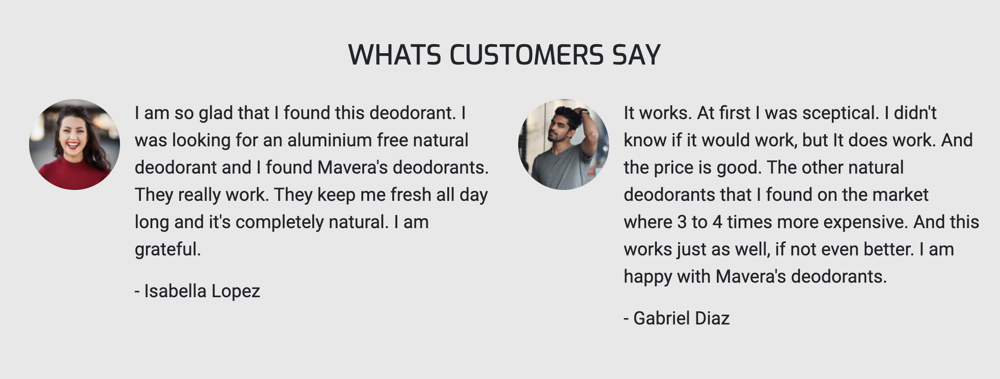

### User Story item 5: 

As a customer or a potential customer to this company I want to support an environment friendly cause and I want to see if this company shares my values.

Answer:

- The banner image on the home page shows the deodorant bottle with the text 100% natural. See image above in User story item 1 section.

- The first headline and text on the home page tells the user that it is an organic product with natural ingredients.
- The second text and headline on the home page tells the user that there are only natural and organic ingredients in the products.

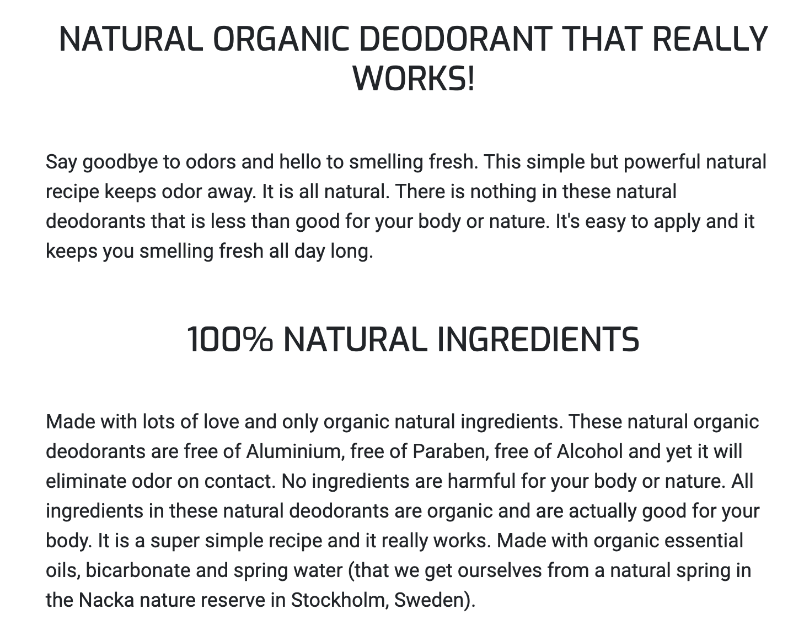

- The mission and vision text on the about page shows the user that the company values are to support an environment friendly cause.

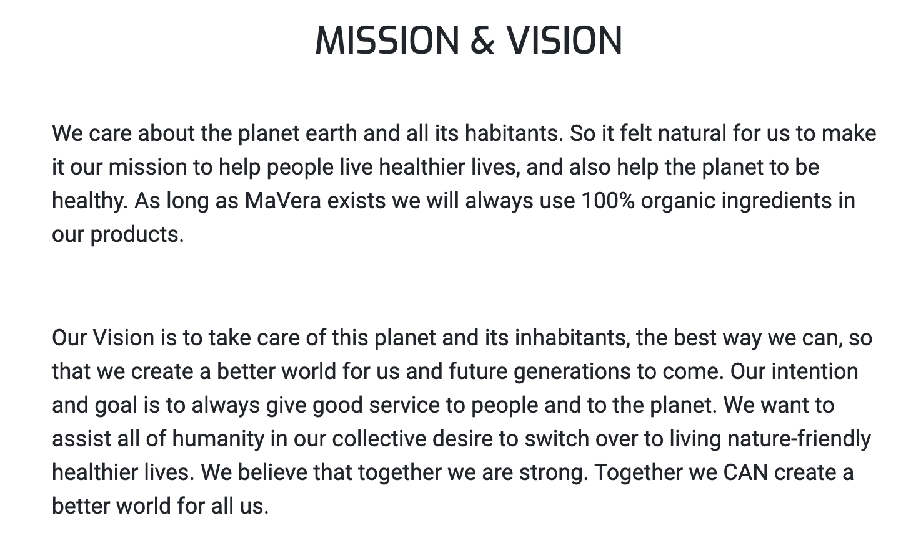

### User Story item 6: 

As a customer or a potential customer to this company I want to learn about how to live a more healthy and environment friendly life.

Answer:

- This website does not really provide an answer to this want at this point. 

- The idea is that the newsletter will provide an answer to this want. 
- A feature left to implement is a blog. One of the purposes for the blog is to help people live more healthy and environment friendly lives. 

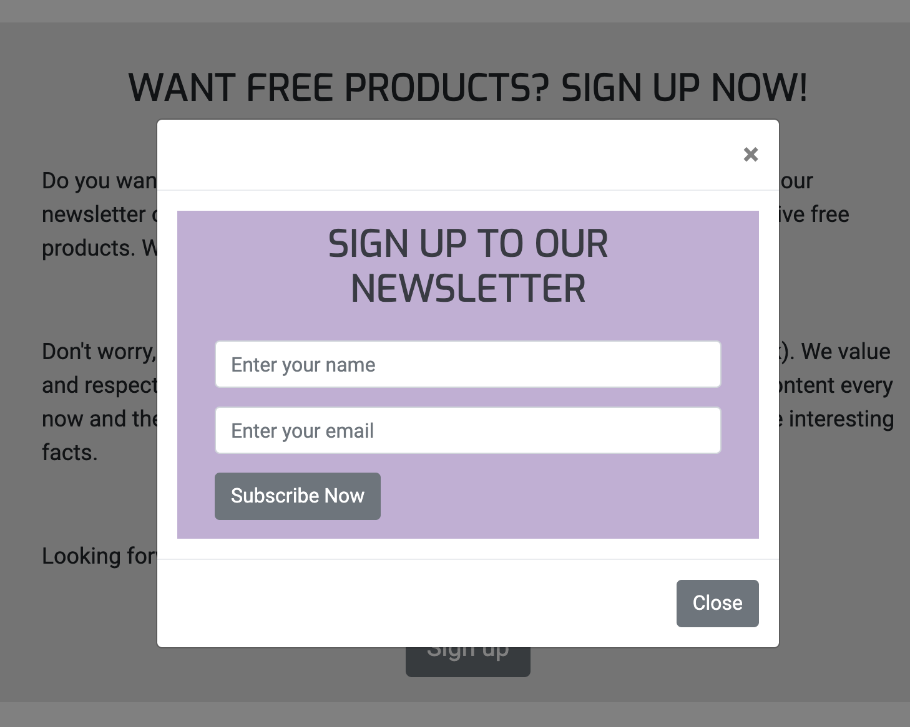

### User Story item 7: 

As a visitor to this website, I want to learn the benefits of organic deodorants.

Answer:

At this point the website don’t mention much about the benefits of using specifically natural organic deodorants, except that it works, will keep you smelling fresh and that is good for your body and nature. In the about text the company mention that using aluminium in deodorants can have harmful effects, but not why it can be harmful.

The plan is to write more about this topic in the blog and give knowledge about the benefits of natural deodorants and the harmful effects of using chemicals and aluminium in deodorants. There are research showing that using deodorant with aluminium can create diseases for the user. The blog will create articles on this topic.

The purpose of the blog is to:

- Raise awareness about the dangers of using non organic and non natural deodorants.

- Content marketing.
- Raise brand awareness

### User Story item 8: 

As a visitor to this website, I want to learn the dangers of non organic deodorants.

Answer:

- Again. This is not mentioned much at this point. It will be covered in the blog.

### User Story item 9: 

As a customer or a potential customer, I want to know the price of the product.

Answer:

- The price is mentioned on the Products page in the text about retailers.

### User Story item 10: 

As a customer or a potential customer, I want to know where I can buy the products.

Answer: 

- There are links on all pages to the Facebook web shop page.

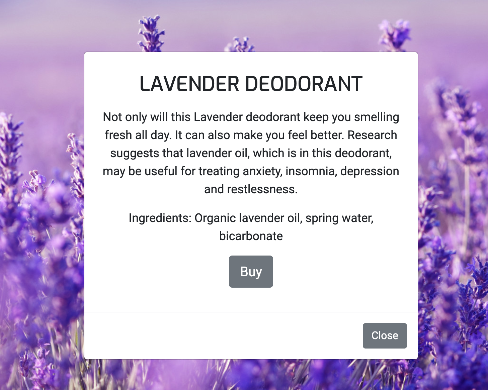

- The user can find out where to buy the products in the retailers text on the Products page.

### User Story item 11: 

As a customer or a potential customer, I want to know about the ingredients in the products.

Answer: 

- The user can find out about the ingredients of each individual product by clicking the read more button on the products card.

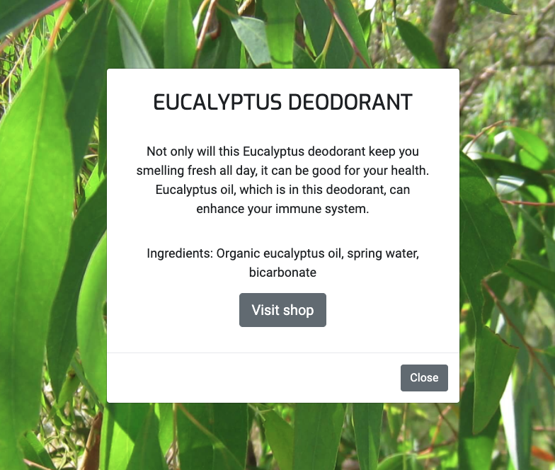

- The bottle image of each product has the text 100% natural to ensure the user that it is only natural ingredients.

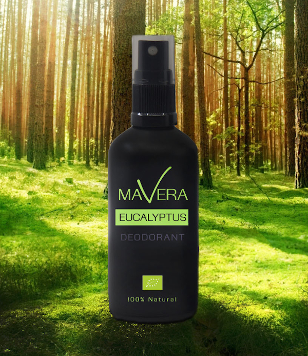

- The texts on the home page tells the user that there is only natural ingredients in all products.

- The mission and vision text on the about page tells the user that there is only natural organic ingredients in all products.

