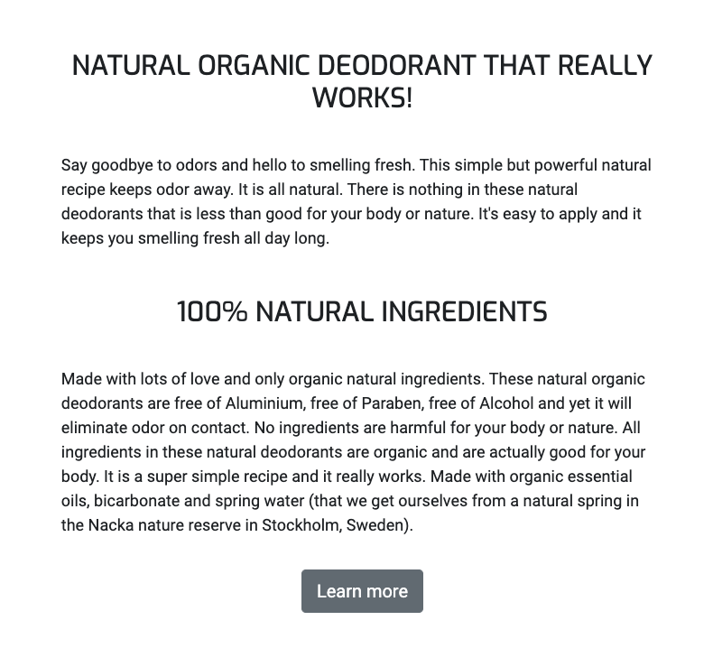
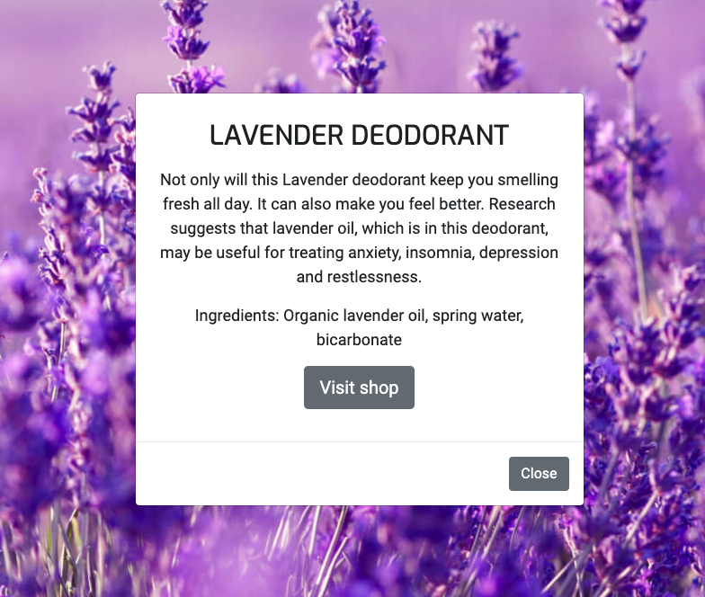

# Mavera Website Testing details

[Main README.md file](README.md)

[View the website in GitHub Pages ](https://marc-solution.github.io/Mavera/)

## Table of contents

1. [Browsers tested](#browsers-tested)
2. [Changes made after testing](#changes-made-after-testing)
3. [W3 validator](#w3-validator)
4. [Contact and newsletter forms](#contact-and-newsletter-forms)
5. [Alt attribute for images](#alt-attribute-for-images)
6. [Testing the user stories](#testing-the-user-stories)
---

# Browsers tested

- Google Chrome
- Firefox
- Safari
- Opera

I tried these browsers. I looked at all the different sizes in the inspect mode ( Except for in safari, because it does not have that option). It works in widescreen, desktop, tablet and mobile.
I have tested it on my laptop computer and also on a big screen. I tested it on two different Iphones and on a Samsung Galaxy. It works as it should on all devises.

I also asked friends to test the website on their mobiles. It all works as it should.

# Changes made after testing

When testing the products cards on the smallest size smartphone and also the tablet size in Google chrome, Firefox and Opera it looked strange. The text got very stretched out and it didn’t look good. I also tested this on a real Iphone and a Samsung Galaxy with the same result. I removed the product info text from the card and changed it to a button with the text Read more. This button opens a modal with the product info text.

After my second mentor session for this project, I added a added links to a fictional facebook webshop. I added a link to the shop in the navbar and also a buy button that links to the fictional shop. The button can be found on all pages, except on the contact page. There is also a buy button in the popup modal in each product card.

I tested the buy button that links to the company’s fictional Facebook web shop. 
I tested it in all browsers and devices i mentioned earlier. It works as it should and the link opens in a new tab.

# W3 validator

#### HTML validator - https://validator.w3.org/

I tested the code in the w3 html validator. I got two errors. The first error was in the what customers say section in the index.html page. The problem was that there was no header directly after the section tag. The header came later in the section. I moved the header so that it comes directly after the section tag. It worked and it was approved.

The second error was in the same section. It had to do with the customer review images. I am not really sure exactly what the second error was. I changed these two things and it got approved. 

- The div that contained the customer images had a class attribute but with no value. I removed that class attribute from the div tag. 
- Secondly, the hight and width properties for the customer images was in the img tag. I moved the hight and width properties to my style.css. 

After doing these changes the code was approved by W3 html validator.

#### CSS validator - https://jigsaw.w3.org/css-validator/

After testing the code in the  CSS validator, there were two errors. But this time the errors where not from any code I've written in my workspace. The errors were from the bootstrap library. The errors were found in this link:

https://maxcdn.bootstrapcdn.com/bootstrap/4.2.1/css/bootstrap.min.css

There where also some warnings. Again it was not from any code I’ve written. It came from the bootsnipp code I use for the newsletter. The warning came from this link script https://cdnjs.cloudflare.com/ajax/libs/jquery/3.2.1/jquery.min.js

I wrote to tutor assistance. They said it will be ok as long as I mention it here in this README. 

# Contact and newsletter forms

I tested the contact and newsletter forms. 
- When submitting without any message an error message about the required fields appears.
- When submitting with an invalid email address an error message about the required fields appears.
- When submitting the form with all inputs valid a success message opens in a new tab.

# Alt attribute for images

For the banner images on the website I use a div with the image as background. I used the title attribute on the banner images to describe the image instead of the alt attribute since an alt attribute won’t work on a div.

# Testing the user stories

### User Story item 1: 

As a new visitor to this company website, I want to instantly know what this company sells to see if it fits my needs.

Answer: 

- The user wants to know what this page website is about. The banner image on the home page show bottles of organic deodorants so that the user will instantly know that this is a website for an organic deodorant. The texts on the home page gives the user information about the product.
- On the mobile version there is another hero image. This image is a close up on the deodorant bottle so that the user easily can read the text on the bottle.
- The first headline of the home page clearly states that it is a website for an organic deodorant.
- The products page shows that the products are organic deodorants.

See the images below.

### User Story item 2: 

As a visitor to this website, I want to easily navigate the site so that I can find what I am looking for.

Answer:

- There is a responsive navbar that makes it easy to navigate the website. 
- If the user wants to know more about the products, they can click the products link in the nav bar. The products page gives the user information about each individual product. It also links to the shop page where they can information on where to buy it. 
- If the user wants to know more about the company, they can click the about link in the nav bar. The about page tells the user about the company values.
- If the user wants to contact the company they can find all the contact information on the contact page. There is a link in the navbar to the contacts page.
- If the user wants to find retailers that sell the products there is information on the shop page.
- If the user wants to buy the product there are several links to the web shop. There is a link to the shop in the navbar and on every page. The shop page provide links to the company webshops.

See images below.

### User Story item 3: 

As a visitor to this website, I want to find organic deodorants.

Answer:

- The home page tells the user that this page is website for a organic deodorant
- The product page provide more information about the deodorants
- The shop page provide retailer information and links to webshops where the user can buy the products.
- The home page provide a link to the products page. The about and products page provide links to the shop page. Also the navbar provide a link to the shop page. It is easy for the user to navigate the website to know where they can get the product

### User Story item 4: 

As a visitor to this website, I want to know if these deodorants really work.

Answer:

- The purpose of the customer reviews on the home page is to give the product credibility and show the user that the product works.
- Also the text about the deodorant on the home page is aimed to convince the user that this product really works.

See images below.

### User Story item 5: 

As a customer or a potential customer to this company I want to support an environment friendly cause and I want to see if this company shares my values.

Answer:

- The banner image on the home page shows a deodorant bottle with the text 100% natural. This reflects the company value and intention to only use natural organic ingredients. (See image above in User story item 1 section)
- The first headline and text on the home page tells the user that it is an organic product with natural ingredients. This reflects the company value and intention to only use natural organic ingredients. (See image above in User story item 4 section)
- The second text and headline on the home page tells the user that there are only natural and organic ingredients in the products. This also reflects the company value and intention to only use natural organic ingredients.
- The mission and vision text on the about page shows the user that the company values are to support an environment friendly cause.

See the image below.

### User Story item 6: 

As a customer or a potential customer to this company I want to learn about how to live a more healthy and environment friendly life.

Answer:

- The company’s  way of spreading awareness of a healthier and more environment friendly lifestyle will mostly be through the blog and newsletter, but also through social media.  For the moment the company answers this need through the newsletter and social media channels. 

- A feature left to implement is a blog. One of the purposes for the blog is to help people live more healthy and environment friendly lives. Other purposes is to raise brand awareness and content marketing.

See the image below.

### User Story item 7: 

As a visitor to this website, I want to learn the benefits of organic deodorants.

Answer:

The benefits told on this website are that it works, will keep you smelling fresh and that it is good for nature. It also tells the user about the health benefits for each product.
The user can read about the benefits on:

- The home page. It tells the user that it works, will keep you smelling fresh and that it is good for your body and nature.
- The products page. Each product modal popup tells a little bit about the health benefits for each product.

The main channel to answer this need will be through social media, the newsletter and also the blog. Through these channels the company will go deeper into this topic.

The website provide several links to Mavera’s social media. 
- There are links to Mavera’s social media in the footer of each page
- There are links to Mavera’s social media in the contact form
- There are links to Mavera’s social media on the shop page

The website provide a newsletter that answers this need.
A newsletter signup form can be found on the about page.

The blog is a feature that is left to implement. 

### User Story item 8: 

As a visitor to this website, I want to learn the dangers of non organic deodorants.

Answer:

This website only mention about the dangers of using non organic deodorants. This is mentioned in the about section.
The company will spread more awareness on this topic in newsletter, blog and social media.

- The user will find a newsletter signup form on the about page
- The user will find several links to the company's social media pages, where they will be posting about this topic.
- A feature left to implement is a blog. There will be posts about this topic in the company's blog

### User Story item 9: 

As a customer or a potential customer, I want to know the price of the product.

Answer:

- The price is mentioned on the shop page in the retailers section.
- This website provide links to the company's webshops where the user can learn about product prices.

See the images below.

### User Story item 10: 

As a customer or a potential customer, I want to know where I can buy the products.

Answer: 

- The retailers section on the shop page tells the user which retailers ( in Sweden ) that sell the products. (See the retailers image in user story item 9 section)
- There are links to the company webshops on the shop page. There is text that tells the user that the links will take them to the webshop. (See the images in user story item 9 section)
- The Footer on all pages provide links to the company webshops. (See image below)
- The products and about page have links to the shop page. On the shop page the user can find information on where to buy the products. (See image below)

See the images below.

### User Story item 11: 

As a customer or a potential customer, I want to know about the ingredients in the products.

Answer: 

- The user can find out about the ingredients of each individual product by clicking the read more button on the products card.
- The bottle image of each product has the text 100% natural to ensure the user that it is only natural ingredients.
- The texts on the home page tells the user that there is only natural ingredients in all products.
- The mission and vision text on the about page tells the user that there is only natural organic ingredients in all products.

See the images below.

